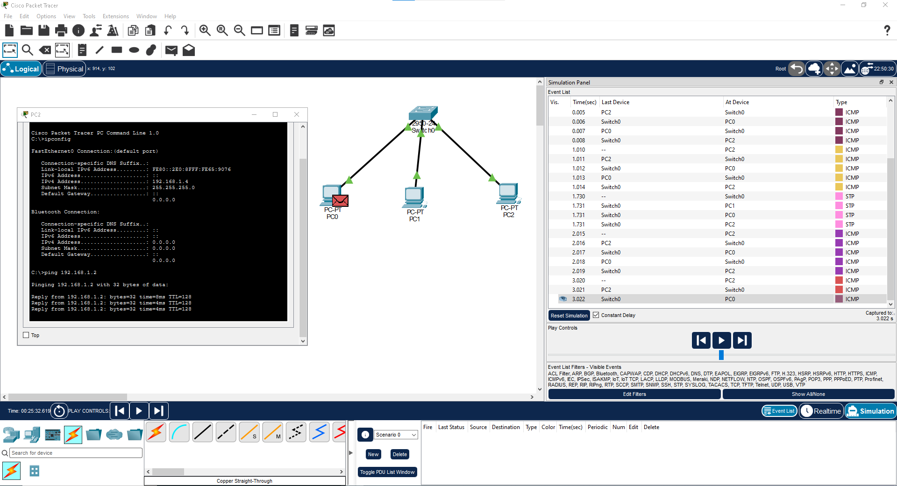

# Lab 01: Red Básica con 3 PCs y 1 Switch

**Objetivo:** 
Configurar una red LAN básica y verificar conectividad entre 3 equipos usando Cisco Packet Tracer.

**Herramientas utilizadas:**
- Cisco Packet Tracer

**Topología:**
PC0 --- 
         Switch0 --- PC2
PC1 --- 

**Configuración IP:**
- **PC0**: IP 192.168.1.1  / Máscara 255.255.255.0
- **PC1**: IP 192.168.1.2  / Máscara 255.255.255.0  
- **PC2**: IP 192.168.1.3  / Máscara 255.255.255.0

**Prueba de conectividad:**
Se realizó ping desde PC2 `192.168.1.3` hacia PC1 `192.168.1.2` 
Resultado: `Reply from 192.168.1.2: bytes=32 time=4ms TTL=128` ✅ 100% éxito

**Conclusión / Aprendizaje:**
Comprendí el funcionamiento de un Switch en la Capa 2 del modelo OSI. 
El Switch aprende direcciones MAC y reenvía tramas entre dispositivos.

