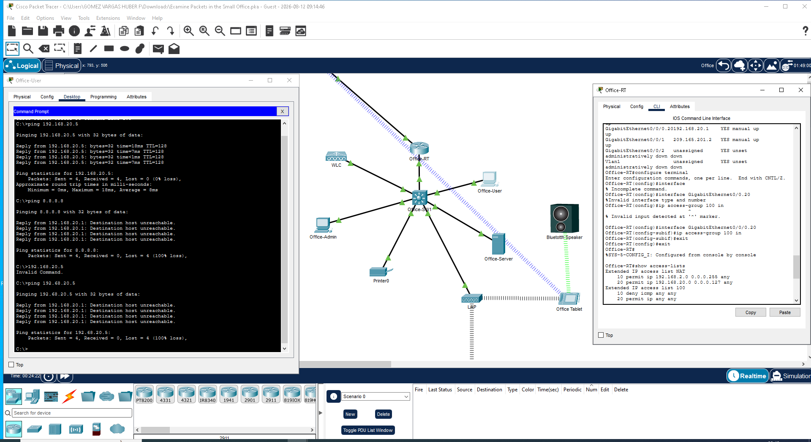

# Lab 04 - Configuración de ACL para Bloquear ICMP

## 1. Objetivo
Implementar una Access Control List en el router para
restringir el tráfico ICMP y verificar su funcionamiento en 
la red de oficina.

## 2. Descripción de la práctica
En esta práctica se configuró una ACL estándar en el router 
`Office-RT` para bloquear los mensajes de ping hacia Internet
, permitiendo el resto del tráfico IP.

**Comandos utilizados:**
Router(config)# access-list 100 deny icmp any any
Router(config)# access-list 100 permit ip any any
Router(config)# interface GigabitEthernet0/0/0.20
Router(config-subif)# ip access-group 100 in

## 3. Evidencia

En la imagen se observa la ACL 100 configurada y aplicada, y la 
prueba de ping a 8.8.8.8 con resultado `Destination host 
unreachable` y 100% de pérdida, comprobando el bloqueo.

## 4. Conclusión
La ACL 100 se aplicó correctamente en el router. Se verificó que
el tráfico ICMP es bloqueado, cumpliendo con el objetivo de la 
práctica.

## 5. Herramientas
- Cisco Packet Tracer
