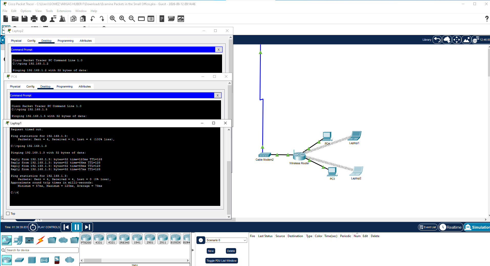

# LAB05 - Configuración de Red Inalámbrica Segura

## Objetivo
Configurar una red WLAN en Cisco Packet Tracer utilizando seguridad WPA2-PSK y verificar la conectividad entre dispositivos inalámbricos.

## Topología de Red
- 1 Wireless Router
- 2 Laptops con adaptador inalámbrico
- 1 Cable Modem
- 2 PC de escritorio

## Configuración

### 1. Configuración del Wireless Router
- **SSID:** Red_Lab05
- **Seguridad:** WPA2-PSK
- **Contraseña:** lab05upao
- **Gateway:** 192.168.1.1
- **DNS:** 203.0.0.2

### 2. Configuración Laptop1
- **IP:** 192.168.1.2
- **Máscara:** 255.255.255.0
- **Gateway:** 192.168.1.1
- **DNS:** 203.0.0.2
- **MAC:** 00:04:9A:1D:DA:EC

### 3. Configuración Laptop2
- **IP:** 192.168.1.3
- **Máscara:** 255.255.255.0
- **Gateway:** 192.168.1.1
- **DNS:** 203.0.0.2
- **MAC:** 00:60:5C:46:97:57

## Pruebas de Conectividad
Se realizó ping entre las laptops para verificar la comunicación:

`ping 192.168.1.3` desde Laptop1
`ping 192.168.1.2` desde Laptop2

**Resultado:** 0% de pérdida de paquetes. Conexión exitosa.

## Evidencia Gráfica

## Conclusión
Se logró implementar correctamente una red inal
