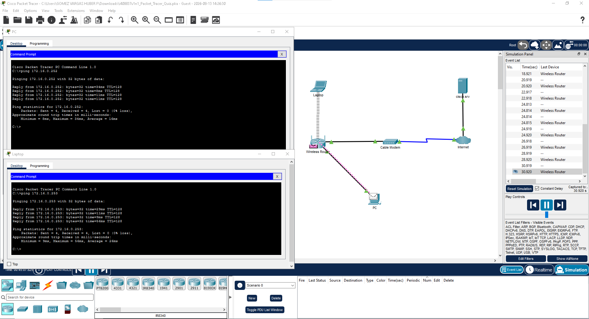

# LAB 06: RED DOMESTICA SOHO

## 1. OBJETIVO
Configurar una red domestica en Packet Tracer con conectividad LAN 
entre PC y Laptop mediante Wireless Router.

## 2. TOPOLOGIA
Red SOHO: PC + Laptop conectados al Wireless Router. El router se
conecta al Cable Modem y este a Internet donde esta el Servidor
cisco.srv

## 3. DIRECCIONAMIENTO
| Dispositivo | IP | Mascara | Gateway |
| --- | --- | --- | --- |
| PC | 172.16.0.253 | 255.255.255.0 | 172.16.0.254 |
| Laptop | 172.16.0.252 | 255.255.255.0 | 172.16.0.254 |
| Router | 172.16.0.254 | 255.255.255.0 | - |
| Servidor | 200.100.20.10 | 255.255.255.0 | - |

## 4. DESARROLLO
### 4.1 Configuracion
1. Se configuro el Wireless Router 
2. Se activo DHCP para que PC y Laptop obtengan IP automaticamente
3. Se conecto la Laptop via WiFi y el PC por cable
4. Se configuro el servidor cisco.srv con servicios DNS y HTTP

### 4.2 Prueba de Conectividad
Se realizo ping bidireccional entre PC y Laptop para verificar
la conectividad LAN.

**Resultados:**
- PC -> Laptop 172.16.0.252: 4/4 paquetes recibidos. 0% perdida
- Laptop -> PC 172.16.0.253: 4/4 paquetes recibidos. 0% perdida

## 5. EVIDENCIA

*Figura 1: Prueba de conectividad LAN exitosa entre PC y Laptop*

## 6. CONCLUSION
Se logro configurar correctamente la red domestica. Los dispositivos 
en la LAN se comunican sin perdida de paquetes. La red esta lista
para implementar los servicios de DNS y WEB en el servidor.
